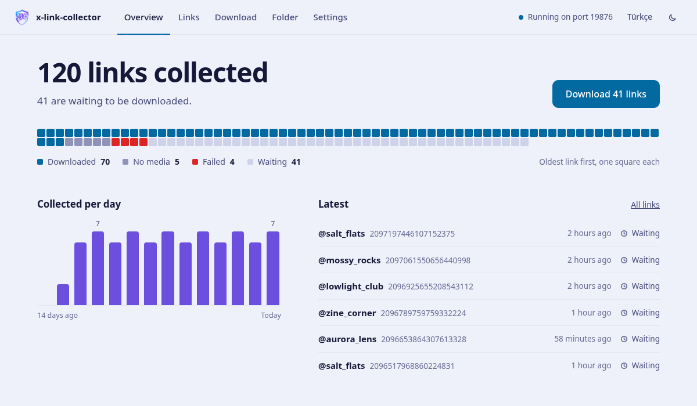

<div align="center">


# x-link-collector

**Middle-click tweets while you read. They file themselves and the tab closes.**

[](https://github.com/abel0x/x-link-collector/actions/workflows/ci.yml)
[](LICENSE)
[](#platform-support)

</div>

---

Open a tweet in a new tab and three things happen before you look up: the link is
cleaned, appended to a text file on your desktop, and the tab closes itself. Later,
one click in the panel downloads the media behind every link it collected.

```
  middle-click            extension              receiver             links.txt
  a tweet        ──────>  cleans the    ──────>  writes it   ──────>  on your
                          URL, closes            once, never          desktop
                          the tab                twice                    │
                                                                          ▼
  x-media/<handle>/<tweet id>-1.mp4    <──────   downloader   <──────  the panel
```

<picture>
  <source media="(prefers-color-scheme: dark)" srcset="docs/panel-dark.png">
  
</picture>

## Quick start

<details open>
<summary><b>From a release</b> — no compiler needed</summary>

Take the archive for your system from
[Releases](https://github.com/abel0x/x-link-collector/releases) and unpack it.

- **Windows:** double-click `x-link-receiver.exe`. The panel opens in your browser.
- **Linux, macOS:** run `./x-link-receiver --open` from the unpacked folder.

The panel then offers to install the download tools, which needs
[Python 3.9+](https://python.org). See [Installing a release](#installing-a-release)
for the one-time warnings macOS and Windows show for unsigned programs.
</details>

<details>
<summary><b>From source</b> — Linux / macOS</summary>

```sh
git clone https://github.com/abel0x/x-link-collector
cd x-link-collector

make service            # build, install, and run it at every login
make panel              # open the panel in your browser
```

`make run` starts it in the foreground instead. Needs [Rust](https://rustup.rs);
the download tools need Python 3.9+.
</details>

<details>
<summary><b>From source</b> — Windows</summary>

```powershell
git clone https://github.com/abel0x/x-link-collector
cd x-link-collector

.\scripts\setup.ps1 -Autostart   # build, install the tools, start it at every logon
```

Needs [Rust](https://rustup.rs) and [Python 3.9+](https://python.org).
</details>

Then load the extension: open `vivaldi://extensions` (or `chrome://extensions`),
turn on **Developer mode**, click **Load unpacked**, and pick the `extension/`
folder. Middle-click a tweet — the toolbar badge counts what it saves, and clicking
the icon opens the panel. To keep a tweet without opening it at all, right-click
the link and choose **Collect this tweet**.

## The panel

`x-link-receiver` serves it at <http://127.0.0.1:9876>. It is part of the binary:
there is nothing else to install, and it loads nothing from anywhere else.

| | |
|---|---|
| **Overview** | One square per link, oldest first, coloured by what the downloader made of it, and the one button worth pressing next. |
| **Links** | Every link with a thumbnail of what was downloaded; click it to see the photo or play the video. Search, filter by state, see why a download failed, fetch or retry a single link, paste a list in, take a link out. |
| **Download** | Start, follow and stop a download, with the choices `x-download` has: mirrors, your own login, parallel downloads, a limit, a dry run. Or let new links download by themselves. |
| **Folder** | What is on disk, and the one-folder [flatten](spliter/) — with undo. |
| **Settings** | Where links and media go, and the rest. Also installs or updates yt-dlp and gallery-dl, and says so when they have grown old enough to break. |

It speaks English and Turkish, follows your system's light or dark theme, and fits
a phone-sized window. Allow notifications and it tells you when a download
finishes in a tab you are not looking at.

## Downloading the media

Press **Download** in the panel, or from a terminal:

```sh
make download            # everything new, best quality X serves
make download-all        # including age-restricted tweets
make download-status     # what has been collected so far
```

Media lands in `<desktop>/x-media/<handle>/<tweet id>-1.mp4`. Every link is
fetched exactly once, and stopping is free — the panel's Stop, Ctrl-C, `--limit`,
`--batch` all resume where they left off. See **[downloader/README.md](downloader/README.md)**.

## What is in here

| | |
|---|---|
| **[receiver/](receiver/)** | A dependency-free Rust daemon on `127.0.0.1:9876`. Appends links, deduplicates, fsyncs each write, and serves the panel. 935 KB static binary, under 1 MB RSS, one idle thread. |
| **[extension/](extension/)** | Manifest V3 service worker for Vivaldi, Chrome, Brave and Edge. Cleans the URL, posts it, closes the tab once the write is confirmed. |
| **[downloader/](downloader/)** | Fetches the media behind the links, once each, via yt-dlp and gallery-dl. Resumable, deduplicating, with routes for age-restricted tweets. |
| **[spliter/](spliter/)** | Flattens the per-handle folders into one directory. Reversible. |

## Three rules the extension never breaks

**It only closes a tab it watched being created.** Clicking through your feed is a
same-tab navigation; those tabs are left completely alone. Once a new tab settles
on something that is not a tweet, it is dropped from the watch list for good.

**A tab is closed only after the receiver answers 2xx.** If the receiver is down
the tab simply stays open, nothing is lost, and the worker pauses instead of
retrying every tab.

**A tweet you open from the panel stays open.** The panel's links are there to be
read, so a tab the panel opened is never collected.

All three are covered by tests in `extension/test/`.

## URL cleaning

```
https://mobile.twitter.com/jack/status/20/photo/1?s=20&t=TRACKING#top
                        ->  https://x.com/jack/status/20
```

Deduplication keys on the **tweet id**, because x.com serves the same tweet under
any handle in the path — `/alice/status/1` and `/bob/status/1` are one link.

## Where files go

`links.txt` and `x-media/` live on your desktop, resolved per platform:

| | |
|---|---|
| Linux | `XDG_DESKTOP_DIR` from `~/.config/user-dirs.dirs` — correct on localised installs, where the desktop is `~/Masaüstü`, `~/Escritorio`, `~/Bureau` rather than `~/Desktop` |
| macOS | `~/Desktop` |
| Windows | `%USERPROFILE%\Desktop`, or the OneDrive-redirected one when that is where it actually lives |

Change either in the panel's Settings. They are saved, with every other setting,
to one file:

| | |
|---|---|
| Linux | `~/.config/x-link-collector/config.json` |
| macOS | `~/Library/Application Support/x-link-collector/config.json` |
| Windows | `%APPDATA%\x-link-collector\config.json` |

`x-download` and `x-flatten` read it too, so a choice made in the panel holds on
the command line; an option given there still wins, as does
`x-link-receiver --file ~/notes/tweets.txt`, which the panel then shows as fixed.
Next to the settings, `history.tsv` records when each link was captured, so
`links.txt` itself stays one URL per line.

## Installing a release

Each archive holds the receiver, the downloader, the flattener and the extension,
plus a `.sha256` to check it against. The receiver finds the two Python tools next
to itself, and the extension loads from the `extension` folder inside.

<details>
<summary><b>Linux</b> — one binary, every distribution</summary>

```sh
tar xzf x-link-collector-linux-x86_64.tar.gz
./x-link-collector-linux-x86_64/x-link-receiver --open
```

Statically linked against musl, so there is no glibc version to match and no
separate Debian, Ubuntu, Fedora or Alpine build to pick between.
</details>

<details>
<summary><b>macOS</b> — clear the quarantine flag first</summary>

```sh
tar xzf x-link-collector-macos-arm64.tar.gz
xattr -d com.apple.quarantine x-link-collector-macos-arm64/x-link-receiver
./x-link-collector-macos-arm64/x-link-receiver --open
```

The binary is not code-signed, so Gatekeeper blocks it until that attribute is
removed. Take `macos-arm64` for Apple Silicon, `macos-x86_64` for Intel.
</details>

<details>
<summary><b>Windows</b> — SmartScreen will warn once</summary>

Unzip and double-click `x-link-receiver.exe`. It is not signed, so SmartScreen
shows "Windows protected your PC" — **More info → Run anyway**. The daemon binds
loopback only, so no firewall prompt should appear.

Started that way it opens the panel and then runs without a window; its log
goes to `%APPDATA%\x-link-collector\receiver.log`. Double-clicking it again
just opens the panel. In the panel, **Settings → Start when you sign in to
Windows** keeps it running from then on, and **Quit x-link-receiver** stops it.
</details>

Building from source avoids both warnings, and takes about ten seconds.

## Platform support

| | receiver | extension | downloader | spliter |
|---|---|---|---|---|
| Linux | ✅ | ✅ | ✅ | ✅ |
| macOS | ✅ | ✅ | ✅ | ✅ |
| Windows | ✅ | ✅ | ✅ | ✅ |

CI builds and runs the full test suite on all three on every push, so the badge
above is the real check. The receiver uses `poll(2)` and `signal(2)` on Unix and
a console control handler on Windows; the Python tools are standard library only
and shell out to yt-dlp / gallery-dl, which run everywhere too.

Platform-specific things that are handled rather than assumed: localised desktop
folders, OneDrive-redirected Desktop, virtualenv layout (`Scripts\` vs `bin/`),
Windows reserved device names (`con`, `nul`, `com1`) appearing as an X handle, and
CRLF line endings in a hand-edited `links.txt`.

## Privacy

Everything is local. The receiver binds loopback only and **refuses any request
carrying a web-page `Origin`** — without that rule, any site you visit could
append lines to your file. The panel goes one step further and answers only to
`127.0.0.1` and `localhost`, so a site cannot reach it by pointing its own domain
at your machine. Nothing is uploaded anywhere.

The one exception is opt-in and announced: the mirror route (`--mirror`, or
**X, then mirrors** in the panel) sends a tweet id to `api.fxtwitter.com` /
`api.vxtwitter.com` when X itself refuses the link.

> **Your `links.txt` and `x-media/` are personal data.** Both are in `.gitignore`,
> along with videos, images and `cookies.txt`. Check `git status` before your first
> push anyway.

## Tests

```sh
make test        # 46 Rust unit tests, 15 service worker tests, 21 for the Python tools
make smoke       # start the built receiver and use it end to end
```

CI runs the smoke test on Linux, macOS and Windows, against the binary it just
built.

## Licence

[Apache 2.0](LICENSE). yt-dlp (Unlicense) and gallery-dl (GPL-2.0) are invoked as
external programs, installed separately, and are neither bundled nor linked — see
[NOTICE](NOTICE).
